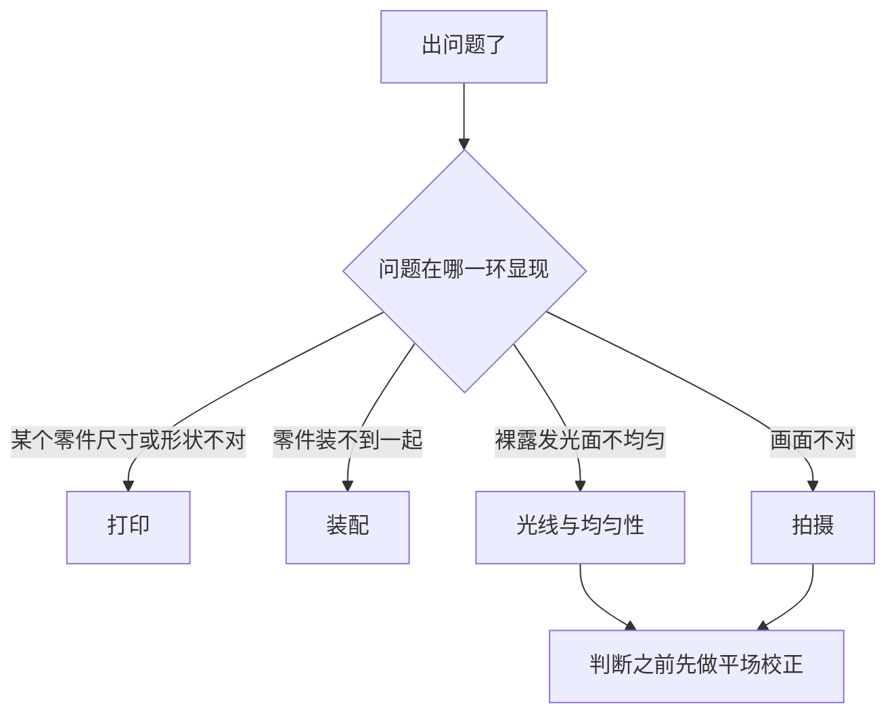

# 故障排查

[English](troubleshooting.md) · **简体中文** · [日本語](troubleshooting.ja.md)

> 这个设计真正可能产生的故障——打印时、装配时、光线本身，以及相机端——每一条都给出现象、可能原因和处理办法。

**目录：**[怎么用这一页](#怎么用这一页) · [打印](#打印) · [装配](#装配) · [光线与均匀性](#光线与均匀性) · [拍摄](#拍摄) · [还是搞不定](#还是搞不定)

## 怎么用这一页

> [!NOTE]
> 本设计还没有被打印出来，也没有被实际搭建过。下面每一行都是几何结构、材料或者流程本身能够造成的故障——从设计推导出来的，不是从维修记录里来的。这里没有任何一个数字是实测结果。

去找那些稀奇古怪的原因之前，先把下面这几条过一遍。这一页上的多数现象，最后都能追回到其中某一条：

- [ ] 每个零件都通过了[装配前逐件检查](printing.zh-CN.md#装配前逐件检查)——没有哪个被切片软件缩放过。
- [ ] 乳白亚克力扩散板**两面**的保护膜都已经撕掉。
- [ ] 闪光灯平躺在桌面上，灯头居中对准敞开前口，变焦设在最广一档。
- [ ] 房间够暗，没有顶灯直射箱口。
- [ ] 相机已经用镜子法对正过——小镜子放在台上，实时取景里让镜头自己的倒影居中。
- [ ] 玻璃模式：这次开工前，防牛顿环玻璃的底面已经吹过灰，才放回台阶里。

---

## 打印

| 现象 | 可能原因 | 处理办法 |
|---|---|---|
| 某个零件量出来比[九个零件](printing.zh-CN.md#九个零件)里那张卡片上的尺寸小 | 切片软件把它缩放到了打印床能放下的大小 | 按 100 % 比例、毫米单位重新切片并重打。最大的零件也只有 154.8 mm，160 × 160 的床就放得下，不需要任何缩放——所以缩放一定是误操作。再走一遍验收检查。 |
| 主箱或者顶盖台有一个角从打印床上翘起来了 | 机器冷、有穿堂风，或者床面脏了 | 换干净的床面、避开风口重打，用你机器习惯的那种粘床手段。翘角不是外观问题：顶盖台就搁在箱壁顶上，胶片面又立在顶盖台上，这两个面里任何一个变形，上面的一切都会跟着晃。 |
| 某个零件的悬空处垂塌、毛糙 | 切片时摆放方向不对 | 每个零件都免支撑，但只在规定的那个朝向下成立：夹底座、插片、主箱、顶盖台平底朝下——两个夹上盖则**顶面朝下**。摆正方向重打；已经打成这样的件没有任何补救办法。 |
| 白色件回来是亮面或者丝面的 | 用了丝面或亮面耗材 | 只能换哑光料重打。裸露的白色内壁*就是*那面反射器；亮面会把灯头映成一块亮斑，往内壁上喷涂不是解决办法。 |
| 台阶出现的高度和零件卡片对不上 | [层高](glossary.zh-CN.md#层高)（layer height）除不尽设计的 0.2 mm 网格 | 夹子这一族零件按 0.2 mm 层高打。承台和元件台阶之间那道 0.4 mm 的落差决定了胶片的活动间隙，只有落在网格上才打得准（[设计日志第 18 条](design-log.zh-CN.md#18-夹子按层高量化)）。 |

> [!CAUTION]
> 绝不要靠加支撑去硬凑一个别的打印朝向。这套件里每个零件都是按免支撑设计的——但只在规定的朝向下成立。两个夹上盖顶面朝下，其余一律平底朝下。这个项目描述打印朝向时，永远只用你看得见的特征。

---

## 装配

| 现象 | 可能原因 | 处理办法 |
|---|---|---|
| 顶盖台在主箱上晃，或者有一个角翘着不贴 | 四个定位榫没有全部落进榫槽，或者榫、槽边缘有[象足](glossary.zh-CN.md#象足)（elephant foot） | 把顶盖台整个提起来重新放一次，让四个榫靠自重落到底。还晃的话，用刀轻轻刮掉榫上的第一层，通常就好了。绝不要硬压，也不要垫东西。 |
| 夹上盖不是吸上去，反而被弹开 | 有一对或几对磁铁相斥——某颗磁铁压反了 | 拿一颗备用磁铁挨个位置试，找出相斥的那一处。压反的那颗只能取出来、翻面、重新压入。下次装配前，趁所有磁铁还叠成一摞时给每颗的同一面做上记号——底座里记号朝上、上盖里记号朝下——然后再开始压。 |
| 掀上盖（或者拿夹子）的时候，整个台子跟着起来了 | 竖直硬拔要同时对抗所有磁对，而这套件里没有任何东西是被拧死的 | 剥，不要拔：从一个角把上盖（或夹子）掀起来，让磁对一对一对地断开。 |
| 夹子吸不到台面上，或者在台面上滑来滑去 | 四片钢垫片是不锈钢的——不导磁——或者根本没放进沉孔 | 换碳钢或者镀锌垫片，每个沉孔一片，与台面齐平。新到的每一批，当天就拿磁铁试一下。 |
| 磁铁放进孔里是松的，不是压进去的 | 磁孔打大了 | 点一滴 502 胶，并把它压到孔底——磁铁凸出来会改变闭合间隙。 |
| 装上 6 × 6 遮幅插片后，整个夹子高了大约 1 mm | 遮幅插片就是垫在 120 底座下面的 | 这不是故障——设计就是这样。 |
| 扩散板发白，或者布满细密裂纹 | 用了酒精，或者含氨的玻璃清洁剂 | 换一片新的——68 × 118 × 2 mm 的定制裁切很便宜，v4 尺寸的 110 × 130 旧板也可以裁小续用。 |
| 扩散板刚拆封就是一片灰蒙蒙的奶白 | 有一面的保护膜还没撕 | 两面都撕掉。撕掉一面、漏掉另一面是很容易发生的事。 |

> [!CAUTION]
> 绝不要用酒精、氨水或者玻璃清洁剂去擦乳白亚克力扩散板。它会让表面永久性地起细裂纹，而起了裂纹的板就不再是一个均匀的光源。只能用气吹和干的超细纤维布，别的一概不行。

为什么这只箱子里没有任何东西是拧死的——这对处理故障意味着什么

整套件里没有一处螺纹。堆叠靠重力、定位榫和磁铁定位，而通常要靠紧固件去对抗的公差，全部改在相机端吸收：小镜子放在台上，实时取景里让镜头自己的倒影居中，传感器就与胶片面平行了——塑料件带着多少细小误差都无所谓。

所以这里的机械类处理办法永远是*重放、剥开、修毛刺*——绝不是拧紧、加垫片或者把堆叠粘死。有东西晃，就去找它没坐进去的那个位置，而不是把它压住。

---

## 光线与均匀性

下面这些一律在平场帧上判断——胶片夹里不放胶片的裸露发光面，用工作光圈拍的 raw——而且要在[平场校正](glossary.zh-CN.md#平场校正)（flat-field correction）之后再判断。流程见[平场校正与反相](scanning.zh-CN.md#平场校正与反相)。

| 现象 | 可能原因 | 处理办法 |
|---|---|---|
| 校正之后四角仍然不均匀 | 灯头没有居中对准敞开前口，变焦不在最广档，或者混进了房间光 | 按这个顺序来：把灯头对箱口摆正居中；变焦设到最广；把房间调暗。 |
| 四角看着不均匀，但你还没做平场 | 镜头暗角和光源不均被当成同一回事在看 | 先校正，后判断。 |
| 有一块亮斑，形状能认出是灯头 | 白色耗材是亮面或者丝面的，或者内壁被打磨、抛光、喷涂过 | [混光腔](glossary.zh-CN.md#混光腔)（integrating cavity）必须是耗材本色的哑光白。除了换新件，没有别的办法。 |
| 整体比测光表给的读数暗 | 反弹混光本身就要吃光——这是均匀性的代价 | 先加闪光出力，再考虑加 ISO。 |
| 画面发灰、蒙着一层雾，反差低 | 白色台面把杂光从夹子四周反上来，或者顶灯直射着箱口 | 把可选的黑色植绒贴贴到台面上，并让顶灯照不到箱口。闪光量远大于环境光——但前提是房间够暗。 |
| 均匀性和上次开工时不一样了 | 闪光灯在桌面上被挪动过 | 用胶带或画线标出它的位置，让灯头每次都回到箱口前的同一个地方。 |

> [!IMPORTANT]
> 先解决平行度，再去追均匀性。闪光脉冲能冻住震动，但箱子里没有任何东西能救回一个与传感器不平行的胶片面——整套调整都在相机端，靠镜子法完成——而一旦你开始放大到像素去抠四角，倾斜的胶片面读起来就像是一道亮度渐变。

---

## 拍摄

| 现象 | 可能原因 | 处理办法 |
|---|---|---|
| 整张画面全黑 | 按可能性从高到低：全电子快门、快门快过[同步速度](glossary.zh-CN.md#同步速度)（sync speed）、接收器电池没电、引闪频道没对上、发射器没在热靴里插实 | 先按这个顺序查完，再去动别的——闪光灯、接收器、发射器全都在箱外，查这些一样也不用开箱。全电子快门通常根本不会触发闪光；[EFCS](glossary.zh-CN.md#efcs) 有时候可以。 |
| 画面一部分有曝光，其余是一条干净的暗带 | 快门跑赢了闪光：速度超过了实际同步上限。焦平面快门纸面上同步在 1/160–1/250，而廉价 2.4G 引闪器还要吃掉大约一档 | 从 1/125 s 排查起。暗带消失了，就一档档往回加快，加到暗带重新出现，然后停在低一档上。参数表见[曝光](scanning.zh-CN.md#曝光)。 |
| 每一格都是同一条边发虚，其余是清晰的 | 胶片面与传感器不平行 | 用[平行度](scanning.zh-CN.md#平行度)里的镜子法。这永远不是对焦问题。 |
| 画幅边缘或四角发虚，而且逐格在变 | 胶片没有躺平——压片元件没有完全压服的卷曲 | 按顺序来：先把光圈收到 f/8–f/11——1:1、f/8 时景深约 ±0.4 mm，而插片模式下起伏至多 0.28 mm；再检查装片方向——压片窗插片模式拱面朝**下**，玻璃模式拱面朝**上**；顽固的片子还是不平，就升级防牛顿环玻璃——它对整个画幅连续封顶。 |
| 每一格同一位置都有柔边暗斑 | 玻璃模式：玻璃底面有灰，离焦平面只有 0.2 mm——近到足以成像 | 把玻璃取出来，吹干净底面再放回去；把这变成每次开工的固定动作。亚克力上的灰*不会*成像——它就落在漫射光源本身上——定期擦拭就够了。 |
| 逐格曝光在变 | 一卷之中改过闪光出力，或者电池快没电、闪光灯还没回够电就被放掉了 | 出力在校准时一次定死，细活交给光圈的 1/3 档。等回电指示灯亮起再拍。两套镍氢电池轮换。 |
| 画面上出现一圈圈干涉环 | 玻璃模式下玻璃装反了——防牛顿环的磨砂面必须朝**下**，贴着胶片光亮的片基——或者换上了一片普通玻璃 | 把玻璃翻回磨砂面朝下。插片模式下根本出不了环——见下面的说明——插片模式看到环，说明有别的东西压在胶片上。 |
| 一条片条上有一道贯穿全长的划痕 | 压片元件下面进了砂粒——胶片就是贴着它下方 0.4 mm 的间隙滑过去的 | 每装一条片条之前，把通道和元件底面都吹一遍。 |
| 抽片发滞，或者抽到一半卡住 | 翘起的片边卡在了内轨的断口上，或者长片条的尾巴垂在外面拖着 | 把片条退出来、摆直了重新送——导轨两端各留了 12 mm 的导向段，就是为这个。长片条的尾端用另一只手托着；凸缘顶能搭一把（低于片面 0.2 mm），但悬出去太长还是需要一只手。 |
| 实时取景里边缘字码读起来是镜像的 | 片条装反了 | 哑光的乳剂面朝下对着光，光亮的片基面朝上对着相机。完整步骤见[装片](scanning.zh-CN.md#装片)。 |
| 画幅四周露出一条片边 | 开窗是有意做大的——24 × 36 的画幅配 25 × 37 的窗，每侧约 0.5 mm——用来吸收相机片门的差异和打印机的公差 | 这不是故障。后期裁掉。 |
| 装框幻灯片塞不进去 | 胶片夹只吃片条 | 装框幻灯片不在这个设计的范围之内。 |
| 画幅填不满传感器 | 你这个画幅和传感器的组合所需的[放大倍率](glossary.zh-CN.md#放大倍率)（magnification）不够 | 见[放大倍率与镜头选择](scanning.zh-CN.md#放大倍率与镜头选择)里的表。任何一支 1:1 微距镜都能覆盖这只箱子支持的全部画幅。 |

> [!CAUTION]
> 每装一条片条之前都要吹。过片就是让胶片贴着压片元件下方横向滑过去——卡在里面的一粒砂，会把之后经过的每一格都划伤。划伤的底片是修不回来的。

牛顿环在这副夹子里哪里可能出现、哪里不可能

[牛顿环](glossary.zh-CN.md#牛顿环)（Newton rings）是胶片与光滑坚硬表面近乎贴合时出现的干涉条纹。

用压片窗插片时，影像区不接触任何东西：胶片靠两条边骑在承台上，与上方的插片之间留着 0.4 mm 的间隙，没有任何光学接触，这个机制无从发生。插片模式看到环，说明有东西被加进了夹层——没取下的片袋、随手压上去的一片玻璃。

用玻璃时，接触本身就是设计意图——胶片光亮的片基就贴在玻璃上——而磨砂的防牛顿环面正是用来打散干涉的。磨砂面朝下贴着片基、乳剂面朝着下方的开窗，环就组不起来。所以玻璃模式看到环，意味着玻璃装反了，或者防牛顿环玻璃被换成了普通玻璃。

---

## 还是搞不定

1. **先确定是哪一半出了问题。** 拍一张平场帧——不放胶片，其余一概不动。如果校正后的平场帧是干净的，箱子没问题，问题在相机端。如果不干净，就留在[光线与均匀性](#光线与均匀性)。
2. **把验收检查重跑一遍。**[装配前逐件检查](printing.zh-CN.md#装配前逐件检查)能抓出缩放、变形和配合过紧，而这几样正是让后面一切都做不下去的故障。
3. **一次只改一件事**，每改一次就重拍一张平场帧。校准的那几个补救手段是有意排了顺序的；把最后一条先用上，就把第一条本来能告诉你的信息盖掉了。
4. **把它报上来。** 这个设计从来没有被实际搭建过，所以真实的第一次搭建暴露出来的问题，对所有人都是新信息。仓库是公开的：<https://github.com/Neoanaloglab/Neobox>。

参考资料：[设计](design.zh-CN.md)讲某个零件为什么长成这样，[设计日志](design-log.zh-CN.md#特意没有做的事)讲什么被试过又被否掉，这一页上任何一个你没见过的词都能在[术语表](glossary.zh-CN.md)里查到。

---

← [翻拍扫描](scanning.zh-CN.md) · [文档索引](../README.zh-CN.md#文档) · [术语表](glossary.zh-CN.md) →
